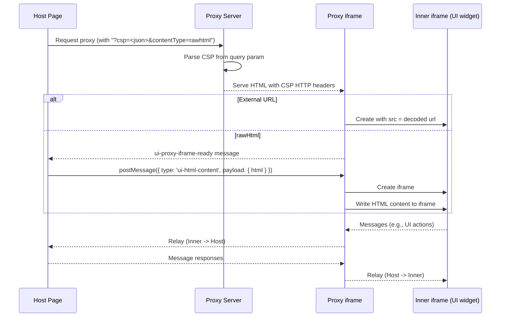

# Using a Proxy Script for External URLs and Raw HTML

When rendering external URLs (`text/uri-list`) or raw HTML (`text/html`), you may need to use a "proxy" to comply with your host's restrictive Content Security Policy (CSP). The proxy domain must be whitelisted as a `frame-src`. The `proxy` prop on `<UIResourceRenderer>` allows you to specify a URL for a proxy script that will render the content in a nested iframe on a different origin.

There are two proxy flows:

- External URLs: the external URL is encoded and appended as `?url=<encoded_original_url>` to the proxy URL. For example: `https://my-proxy.com/?url=<encoded_original_url>`.
- Raw HTML: the proxy is loaded with `?contentType=rawhtml`, and the HTML content is delivered via `postMessage` after the proxy iframe signals it's ready.

::: tip Important
The term "proxy" in this context does not refer to a real proxy server. It is a static, client-side script that nests the UI resource's iframe within a "proxy" iframe. This process occurs locally in the user's browser. User data never reaches a remote server.
:::

## Using the Hosted Proxy

For convenience, `mcp-ui` provides a hosted proxy script at `https://proxy.mcpui.dev`. You can use this URL directly as the `proxy` prop value without any additional setup.

```tsx
import { UIResourceRenderer } from '@mcp-ui/client';

<UIResourceRenderer
  resource={mcpResource.resource}
  htmlProps={{
    proxy: 'https://proxy.mcpui.dev'
  }}
  onUIAction={handleUIAction}
/>
```

Please verify that the host whitelists `https://proxy.mcpui.dev` as a `frame-src` in the CSP.

You can find a complete example for a site with restrictive CSP that uses the hosted proxy at `examples/external-url-demo`.

## Architecture



## Self-Hosting the Proxy Script

If you prefer to host your own proxy script, you can create a simple HTML file with embedded JavaScript. This is a useful alternative to the hosted version when you want more control or a custom domain.

**IMPORTANT**: For security reasons, you **MUST NOT** host the proxy script on the same origin as your main application. `mcp-ui/client` will automatically log an error and fallback to direct iframe if the same origin is detected.

### Proxy Script Requirements

A valid proxy script must:

1.  **External URLs (`url` query parameter)**: Retrieve `url` from the query string, validate it as `http:`/`https:`, and render it in a nested iframe.
2.  **Raw HTML (`contentType=rawhtml`)**: When `contentType=rawhtml` is present, the proxy must:
    - Create a nested iframe and emit a ready signal to `window.parent` with message `{ type: 'ui-proxy-iframe-ready' }`.
    - Receive a `postMessage` from `window.parent` with structure:
      ```typescript
      {
        type: 'ui-html-content',
        payload: {
          html: string
        }
      }
      ```
    - Write the HTML content to the iframe using `document.write()` or similar method.
3.  **Sandbox the Iframe**: For external URLs, the nested iframe should be sandboxed with `allow-scripts allow-same-origin`. For raw HTML mode, the inner iframe does **not** use a sandbox attribute—this is intentional because `document.write()` requires same-origin access to the iframe's document. Security for raw HTML is enforced by the outer iframe's sandbox (controlled by the host) and the double-iframe isolation architecture.
4.  **Forward `postMessage` Events**: To allow communication between the host application and the embedded external URL, the proxy needs to forward `message` events between `window.parent` and the iframe's `contentWindow`. For security, it's critical to use a specific `targetOrigin` instead of `*` in `postMessage` calls whenever possible. The `targetOrigin` for messages to the iframe should be the external URL's origin; Messages to the parent will default to `*`.
5.  **Permissive Proxy CSP**: Serve the proxy page with a permissive CSP that does not block nested iframe content (e.g., allowing scripts, styles, images) since the host CSP is intentionally not applied on the proxy origin.
6.  **(Recommended) CSP via HTTP Headers**: For enhanced security, the proxy server can read a `csp` query parameter and set Content-Security-Policy HTTP headers. See [CSP Query Parameter](#csp-query-parameter) below.

### CSP Query Parameter

When CSP metadata is provided, `mcp-ui` appends it to the proxy URL as a `?csp=<json>` query parameter. This allows proxy servers to set CSP via HTTP headers, which is more secure than meta tags or postMessage-based CSP injection (which can be bypassed by malicious content).

**Example URL:**
```
https://my-proxy.com/?contentType=rawhtml&csp={"connectDomains":["https://api.example.com"],"resourceDomains":["https://cdn.example.com"]}
```

**Server-side implementation (Express example):**
```typescript
import type { McpUiResourceCsp } from '@modelcontextprotocol/ext-apps/app-bridge';

app.get('/proxy', (req, res) => {
  let cspConfig: McpUiResourceCsp | undefined;
  if (typeof req.query.csp === 'string') {
    try {
      cspConfig = JSON.parse(req.query.csp);
    } catch (e) { /* ignore invalid JSON */ }
  }

  const cspHeader = buildCspHeader(cspConfig);
  res.setHeader('Content-Security-Policy', cspHeader);
  res.sendFile('proxy.html');
});

function buildCspHeader(csp?: McpUiResourceCsp): string {
  const resourceDomains = csp?.resourceDomains?.join(' ') ?? '';
  const connectDomains = csp?.connectDomains?.join(' ') ?? '';
  const frameDomains = csp?.frameDomains?.join(' ');

  return [
    "default-src 'self' 'unsafe-inline'",
    `script-src 'self' 'unsafe-inline' 'unsafe-eval' blob: data: ${resourceDomains}`.trim(),
    `style-src 'self' 'unsafe-inline' blob: data: ${resourceDomains}`.trim(),
    `img-src 'self' data: blob: ${resourceDomains}`.trim(),
    `font-src 'self' data: blob: ${resourceDomains}`.trim(),
    `connect-src 'self' ${connectDomains}`.trim(),
    `worker-src 'self' blob: ${resourceDomains}`.trim(),
    frameDomains ? `frame-src ${frameDomains}` : "frame-src 'none'",
    "object-src 'none'",
  ].join('; ');
}
```

::: tip
The CSP is also sent via `postMessage` after the sandbox loads as a fallback for proxies that don't support the query parameter approach. However, HTTP header-based CSP is strongly recommended as it's tamper-proof.
:::

### Example Self-Hosted Proxy

Here is an example of a self-hosted proxy script that meets these requirements (supports both `url` for external URLs and `contentType=rawhtml` + `postMessage` for raw HTML). You can find this file in `sdks/typescript/client/scripts/proxy/index.html`.

<<< @/../../sdks/typescript/client/scripts/proxy/index.html 
